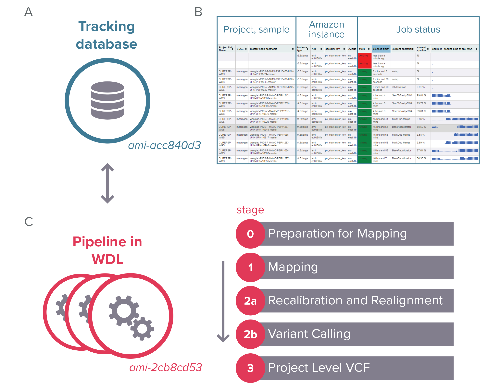

# Introduction

##  Overview of VCPA

VCPA consists of two independent but linkable components: pipeline and database. The pipeline implements are coded in Workflow Description Language \(WDL\) and are fully optimized for the Amazon elastic compute cloud environment. This includes steps for processing raw sequence reads including read alignment and variant calling using GATK. The tracking database allows users to dynamically view the statuses of jobs running and the quality metrics reported by the pipeline. Users can thus monitor the production process and diagnose if any problem arises during the procedure. All quality metrics \(&gt;100 collected per processed genome\) are stored in the database, thus facilitating users to compare, share and visualize the results.

### The figure below outlines the VCPA 

To summarize, VCPA consists of a CCDG/TOPMed functional equivalent pipeline. Together with the public Amazon Machine Image \(AMI\) or dockerized database, users can easily process any WGS/WES data on Amazon cloud with minimal installation.

Availability: VCPA is released under the MIT license and is available for academic and nonprofit use for free. The pipeline source code and step-by-step instructions are available from the [National Institute on Aging Genetics of Alzheimer’s Disease Data Storage Site](http://www.niagads.org/VCPA), as well as from this documentation.

#### AMI availability

Pipeline AMI: ami-2cb8cd53

Database AMI: ami-acc840d3

#### Overview of this documentation

Step 1: Configuration of tools required for VCPA: AWS accounts, keys, command line interface for S3 and Starcluster.

Steps 2-5: Preparation steps required for setting up the tracking database

Step 6: Job submission process

Step 7: Review quality of processed data

Step 8: Generating project level pVCF \(i.e. joint-genotype gVCFs\)

