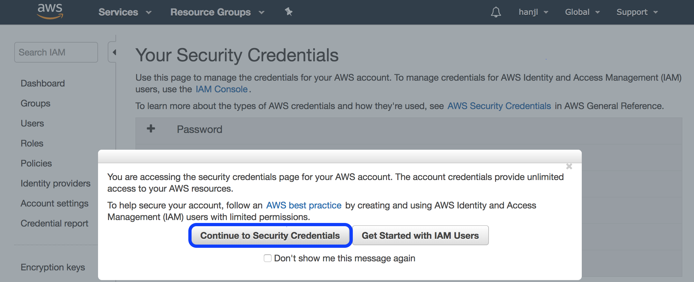
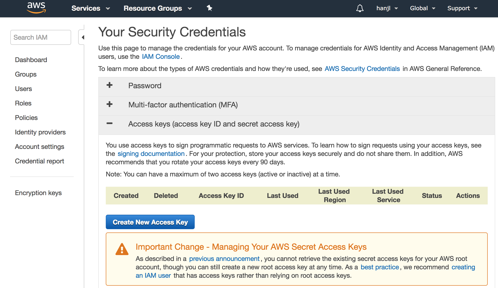
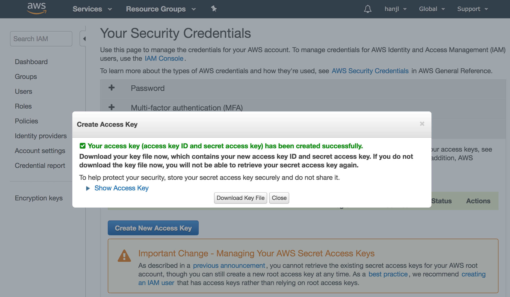

# 1.2 Configure your computing environment and login to AWS

**AWS uses the security credentials to authenticate and authorize your requests.**

To create Access keys \(access key ID, secret access key\) to login to AWS, please perform the following steps.

1. Choose your account name in the navigation bar, and then choose **My Security Credentials \(orange part in the figure\)**. 

    2. A new window will be popped up as below. Click "Continue to Security Credentials" to proceed. 

3. Click "**Create New access Key**" - blue button in the middle of the figure.

4. Click "**Download Key File"** in the pop-up window, and save the access key ID and secret access key to a file in your computer.

