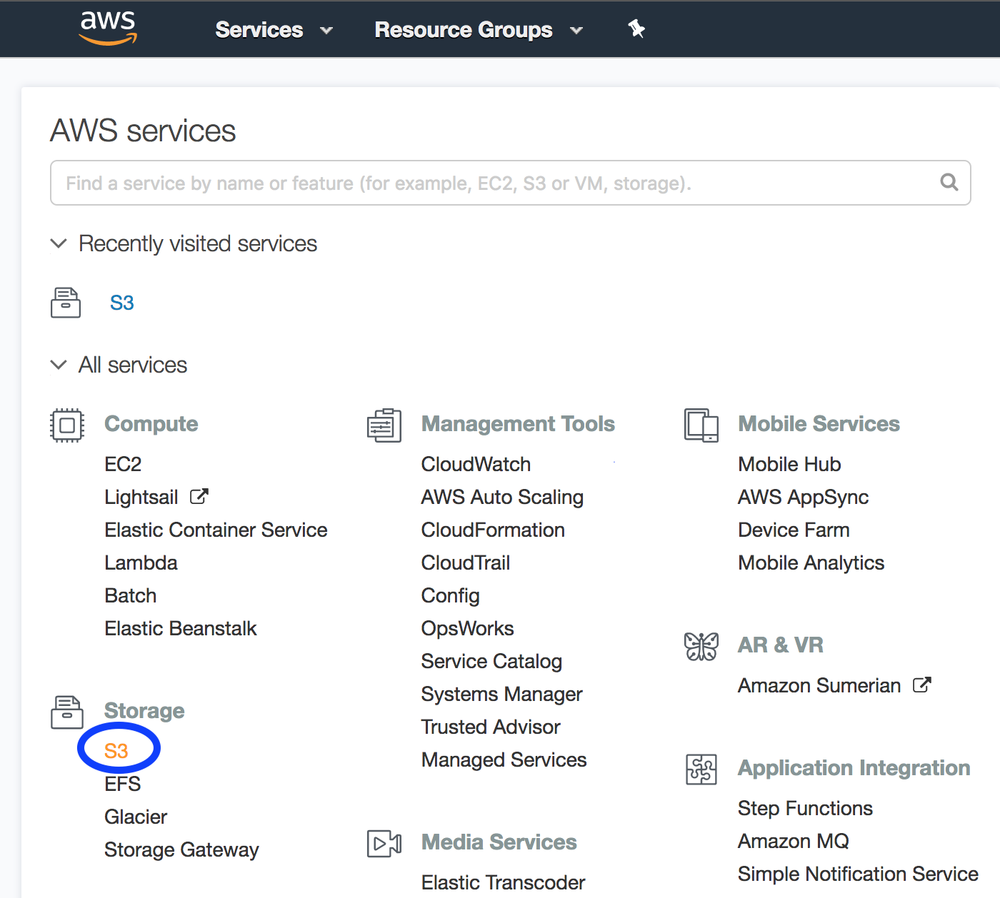
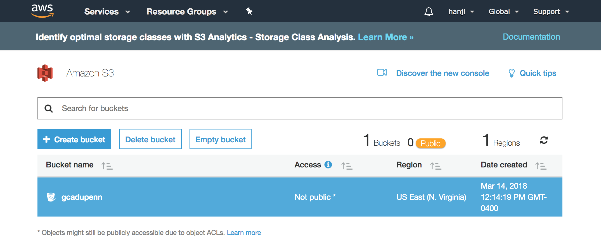

# 1.3 Setup a S3 bucket \(simple storage solution for AWS\) for hosting sequencing data

**This session below introduces you to Amazon S3 and how to use the AWS Management Console to create an S3 bucket.**

1. Open the Amazon S3 console at [https://console.aws.amazon.com/s3/](https://console.aws.amazon.com/s3/). Then click "S3" under "Storage session".

2. After that, a new window will be prompted to allow you to **create bucket** \(see diagram below\). Users need to input

a\) the input bucket name

b\) choose the closest geographical region

Then you will see the list of buckets you created successfully \(see the following figure as an example\).  

