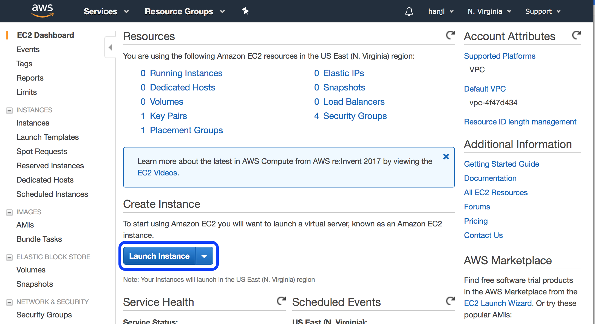

# Option 1: Setup sample tracking database using Public AMI \(recommended\)

#### 1\) click "**EC2 Dashboard**" on your right. Then click "Launch instance" in blue to launch AMI 



#### 2\) Click "**Community AMIs**" on the left panel, then type in "ami-acc840d3" in the search box. Then click select.


#### 3\) Next, choose the appropriate instance - we recommend using t2.micro for the tracking database of VCPA; as this is only used for hosting the database and submitting jobs. Click "**Next: Configure Instance Details**" on the bottom right hand corner to proceed.


#### 4\) Click "**Next: Add Storage**" on the bottom right hand corner to proceed.


#### 5\) Click "**Next: Add Tags**" on the bottom right hand corner to proceed.


#### 6\) Click "**Next: Configure Security Group**" on the bottom right hand corner to proceed.


#### 7\) Then open the **public web port.** Users ****need to configure the security group like "**SSH**" and "**HTTP**". Click "Review and Launch" on the bottom right hand corner to proceed.


#### 8\) Click "**Launch**" on the bottom right hand corner to proceed.


#### 9\) Finally, users can view the the Public DNS/ Public IP information. An example is shown in the "**right box**" in the figure below:


#### Users can then use this DNS/IP information to view the webpage of the tracking database by this _`URL: DNS/v1/projects`_, where users need to specify their own DNS/IP information. See figure below for an example:


Alternatively, users can also view the webpage of the tracking database by the URL: "[http://IP/v1/projects](http://ip/v1/projects)", where IP is the public IP information.


**After the server / instance is setup, users need to login to this tracking database server to configure the projects / samples information and submit jobs. Details will be discussed in Steps 3-6 of the gitbook documentation.**


#### **1\) Please fill in your \[your\_ssh\_key.pem\], \[DNS/Public\_IP\].**

```text
  $ssh -i ~/.ssh/[your_ssh_key.pem] ubuntu@[DNS/Public_IP]  Are you sure you want to continue connecting (yes or no)? yes  Welcome to Ubuntu 16.04.4 LTS (GNU/Linux 4.4.0-1052-aws x86_64)
```

#### **2\) Please add your** _****_**\[AWS\_ACCESS\_KEY\_ID\], \[AWS\_SECRET\_ACCESS\_KEY\].**

```text
 $ sudo nano /var/www/seq-processing/.env
```


