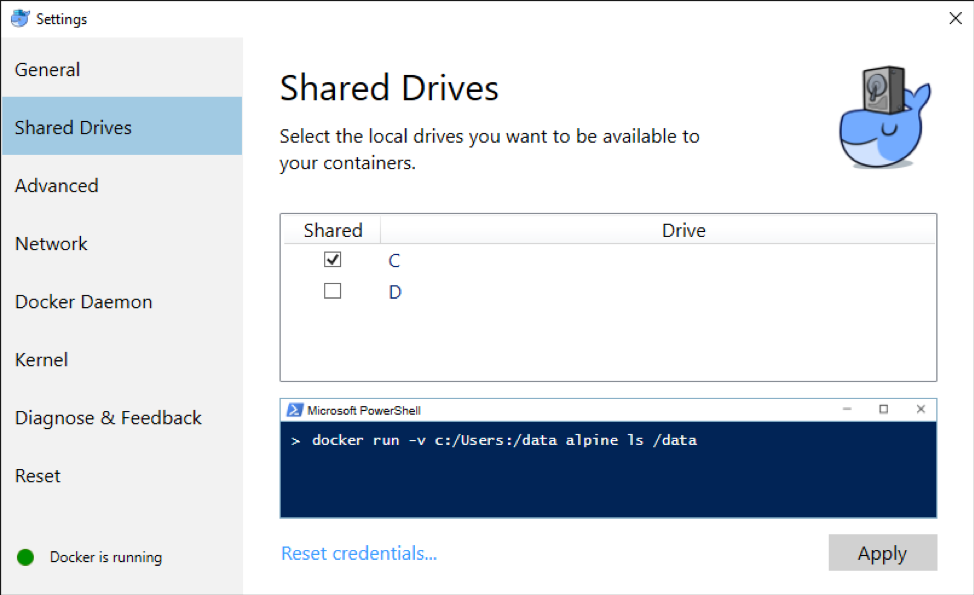

# Option 2: Setup sample tracking database using Docker

Download our sharing code:

```text
 $ git clone --recurse-submodules https://bitbucket.org/NIAGADS/vcpa-web-api.git
```

Then go into the `vcpa-web-api` folder

```text
 $ cd vcpa-web-api
```

and fill in the information to the `.env file` as shown below:

```text
$ vi .envDB_NAME= ### tracking database nameDB_USER= ### tracking database user nameDB_PASSWORD= ### tracking database passwordDB_HOST= ### tracking database hostAWS_ACCESS_KEY_ID= ### AWS access key IDAWS_SECRET_ACCESS_KEY= ### AWS secret access keyAWS_REGION= ### AWS region
```

Users can verify their outcome by typing: docker-compose up; below is an example of what you will see

```text
Successfully built af8f84acc855Successfully tagged gcadwebapi_web:latestRecreating gcadwebapi_web_1 ...Recreating gcadwebapi_web_1 ... doneAttaching to gcadwebapi_mysql_1, gcadwebapi_web_1mysql_1 | [Entrypoint] MySQL Docker Image 5.7.21-1.1.4mysql_1 | [Entrypoint] Starting MySQL 5.7.21-1.1.4web_1 | 172.18.0.1 - - [27/Mar/2018:18:05:55 +0000] "GET /index.php HTTP/1.1" 200 4
```


* This docker instance has the web open to the public to allow remote analysis instances access to this API site.
* Please ensure that this docker host has the default web port \(80\) accessible by public hosts.


### For Linux/MacOS Users

1. Make sure you turn off Firewall for private networks.
2. This image version could directly build on Linux/MacOS.

### For Windows Users

1. Make sure you turn off Windows Firewall for private networks.
2. Modify docker-compose.yml volumes:
   * C:/users/&lt;username&gt;/path-to-bitbucket/vcpa-web-api/scripts/initdb:/docker-entrypoint-initdb.d also change Docker setting 



     3. Make sure init.sh file format is in unix format.

