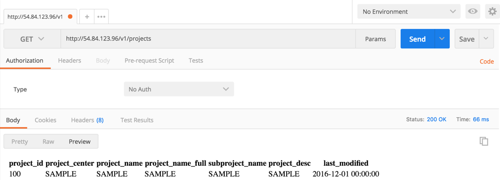

# 3.1 List all projects in the tracking database

**Users can list all projects by typing `http://IP/v1/projects` in any browser, where IP is the public IP address of the tracking database instance.**

